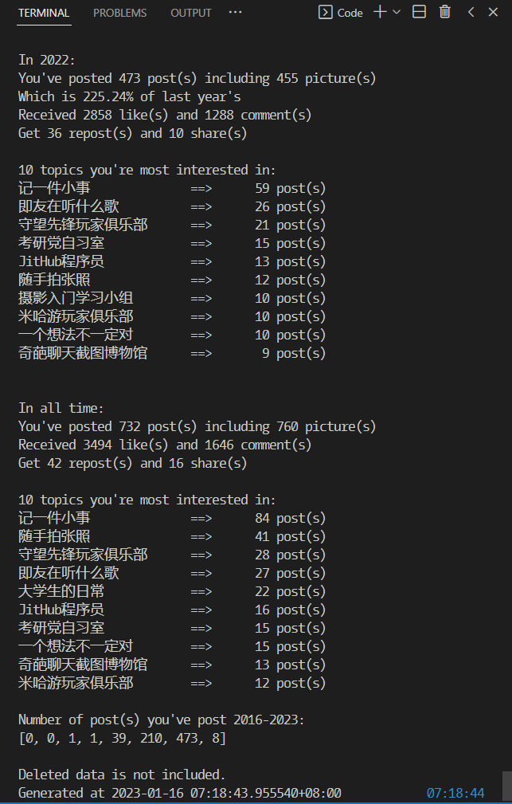
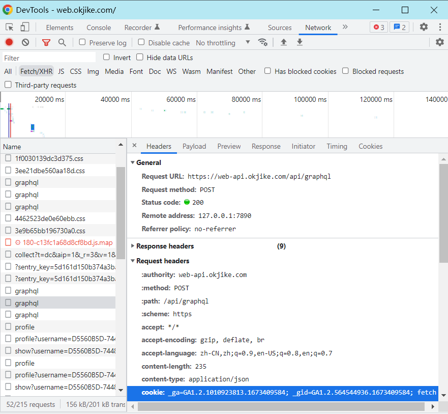
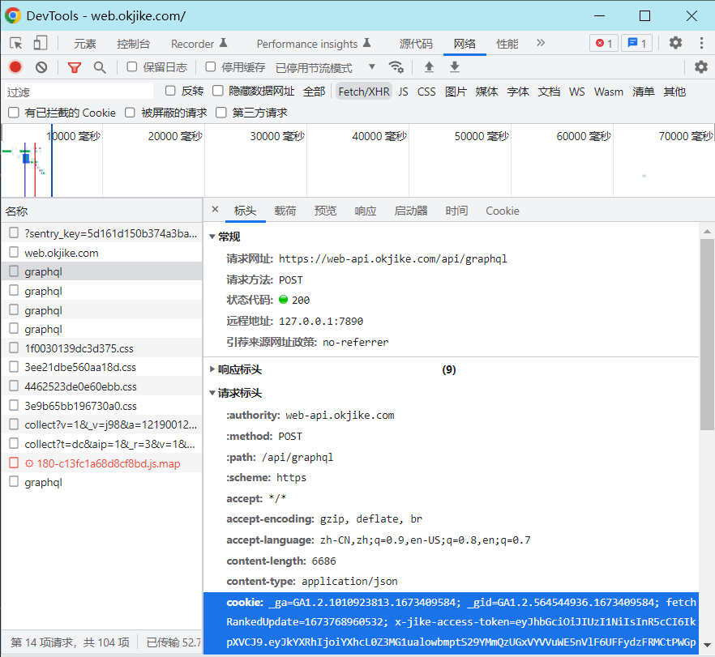

# Jike-crawl

## TODOs

1. Update README.md
2. Add new data on the top of old files
3. Reconstruct project and complete comments

## Jike-crawl (EN)

Crawl all Posts, Notifications, and maybe Collections(undone) on Jike and save them in `csv file`(undone) / `json file` / `MySQL`(undone) before you delete your Jike account.

Count and analysis(undone) infomations and posts.

Maybe using NLP for sentiment analysis(undone).



Haven't implement something like crawl posts posted more than 1 month ago. If you want to do so, please try to learn GraphQL and modified the query or find some code in `data_analysis.py` may helps.

### Requirements

- Python 3
- json
- requests

Download and config Python env. Open this floder in Visual Studio Code.

Install packages on [PyPI](https://pypi.org/).

Or you can run

```shell
pip install -r requirements.txt
```

### Run

Login to [Jike Website](https://web.okjike.com/), press `F12` to open DevTools. Switch to `Network` tab, filter `Fetch/XHR`, refresh the page, then there will be some requests on it.

Select one `profile?username=...` request and copy `username` from `Request URL` into `id` in `main()` in `src/crawl.py` file.

Select one `graphql` request and copy value of `cookie` from `Request headers` into `cookies.txt` file.



Then run.

```shell
python -u [python_file_path]
```

#### Crawl

Choose operations and set your user id in `main()` of `src/crawl.py`.

Make sure you're in `/src`, then run:

```shell
python -u ./crawl.py
```

#### Analysis

Run `src/data_analysis.py`.

You can also modified code in that file to get statistics you like.

## 删号跑路（中文）

在注销即刻账号跑路之前保存自己的动态和消息。

统计并生成报告。


### 环境

- Python 3
- json
- requests

注：`requests` 安装的两种方式，以下均在命令提示符(cmd)中进行。
1.直接安装

```shell
pip install -r requirements.txt
```
2.下载安装
或下载 `requests` 安装包，进入安装包所在路径，运行以下命令

```shell
pip install
```

### 初次运行，保存数据

1. 进入开发者模式。在 [即刻网页版](https://web.okjike.com/)中登录自己的即刻账号，并进入个人主页。按 `F12` 打开开发者工具。切换到 `网络(Network)`，过滤 `Fetch/XHR`，刷新页面，此时下方会出现请求列表，罗列了请求的名称、状态等信息。

2. 获取cookie。在请求列表中，任选一个名称为 `graphql` 的请求，单击 `表头(Headers)`，找到 `cookie` 字段并复制全文，粘贴到 `Jike-crawl/cookies.txt`。

3. 获取id。在请求列表中，任选一个名称为 `profile?username=...` 的请求，单击 `响应(Response)`，复制 `username` 字段:后的内容，粘贴到 `src/crawl.py`中 `main()` 函数里的 `user_id`。



4. 保存数据到本地。运行 `src/crawl.py` 。（打开 `src/crawl.py` ，右键选择在终端中运行；或输入命令 `python -u [python_file_path]`）
`crawl.py` 文件中的 `main()` 函数将把消息列表和个人动态**追加**到 `data/notifications.json` 和 `data/post.json` 中。

```python
    crawl_notifications(noti_path) #拉取消息列表
    crawl_posts(post_path, user_id) #拉取个人动态
```

注：如需重新拉取请先清空上述两个文件中的内容。如不需要拉取消息或动态，可注释对应行代码。

#### 数据分析

必须先运行 `crawl.py` 保存数据，方可进行数据分析。

运行 `src/data_analysis.py`。

您可以修改该文件得到自己想要的统计，如获取评论您最多的用户等。

#### 删除动态

必须先运行 `crawl.py` 保存数据，方可进行动态删除。

此操作仅可根据本地保存的数据进行删除。即在新发动态后，如果没有重新拉取，则无法删除。

1. 若想删除所有动态，请跳过此步。若想修改动态删除的时间范围，请打开 `src/delete_posts.py`将 `main()` 函数中的 `start_time`（开始时间）和 `end_time`（结束时间）修改为所需的日期与时间。

2. 将 `main()` 函数中 `post_path` 修改为储存在本地的`posts.json`的路径。

3. 取消 `clear_all()` 函数中 DANGER ZONE 中的这行注释（按 `Ctrl` + `/` 或删掉这行前面的 `# `）。

```python
# remove(id) # remove posts by id
```
4. 运行 `delete_posts.py`。

## Appendices

### Blog

[周报 #0x01:删号跑路](https://lzzmm.github.io/2023/01/16/weekly-review-1/#project%E5%88%A0%E5%8F%B7%E8%B7%91%E8%B7%AF)

### `datetime`

https://docs.python.org/zh-cn/3/library/datetime.html

### query

`web.okjike.com` uses [GraphQL](https://graphql.cn/learn/queries/) for query.

In folder `query`, there're two types of text files. One with suffix `_original` means that query is used by `web.okjike.com` originally and with too much useless content and avatar urls. Others are used in this project to get useful content.

#### query infomations

payload

```json
{
    "operationName": "ListNotification",
    "query": "query/query_notifications_original.txt",
    "variables": {}
}
```

returns

`"loadMoreKey"` returns `"lastNotificationId"` which can be used to load more.

`"nodes"` contains an array of notifications.

`"id"` maybe the unique key of notifications.

`"referenceItem"` what this notification references to, maybe your post or your comment. If it references to a comment, then `"targetId"` will be the original post id (or see `"targetType"` which will be `"ORIGINAL_POST"`).

`"type"`:

- `"LIKE_PERSONAL_UPDATE"` a user liked your post.
- `"COMMENT_PERSONAL_UPDATE"` a user commented on your post.
- `"LIKE_PERSONAL_UPDATE_COMMENT"` a user liked your comment.
- `"REPLIED_TO_PERSONAL_UPDATE_COMMENT"` a user replied to your comment. Picture will not be shown.
- `"AVATAR_GREET"`
- `"USER_FOLLOWED"` a user followed you
- `"USER_SILENT_FOLLOWED"` a user without `linkUrl` followed you
- `"CURIOSITY_REPLIED_MY_MENTIONING"` on web page, unlike app, it will not show any content.
- `"CURIOSITY_ANSWER_REACTION"` reacted to my answer.
- `"CURIOSITY_MENTION_ME_ANSWER"` asked me to answer.

If `"actionType": "USER_LIST"` then `"actionItem"` will be a list of users liked this post or comment.

If `"actionType": "COMMENT"` then `"actionItem"` will be a comment, also with a user in `users` list.

#### query user feeds

payload

```json
{
    "operationName": "UserFeeds",
    "query": "query/query_user_feeds_original.txt",
    "variables": {
        "username": "D5560B5D-7448-4E1A-B43A-EC2D2C9AB7EC",
        "loadMoreKey": {
            "lastId": "63a450102559c538e1bd3482"
        }
    }
}
```

#### query message detail

payload

```json
{
    "operationName": "MessageDetail"
    "query": "query/query_message_detail_original.txt",
    "variables": {
        "messageType": "ORIGINAL_POST",
        "messageId": "63a3b8b160f43c294d672622"
    }
}
```

#### query message comments

payload

```json
{
    "operationName": "MessageComments",
    "query": "query/query_message_comments_original.txt",
    "variables": {
        "messageId": "6389d93582742179e6a9335c",
        "messageType": "ORIGINAL_POST"
    }
}
```

#### remove message

payload

```json
{
    "operationName": "RemoveMessage",
    "variables": {
        "messageType": "ORIGINAL_POST",
        "id": "63872d0c02237e4e5813435d"
    },
    "query": "mutation RemoveMessage($id: ID!, $messageType: MessageType!) {\n  removeMessage(messageType: $messageType, id: $id) {\n    toast\n    __typename\n  }\n}\n"
}
```
